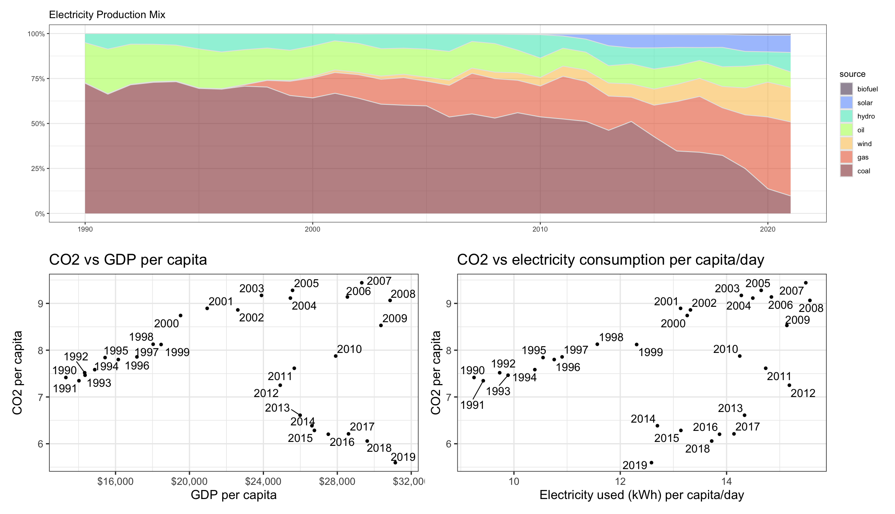

---

```{r}
#| label: load-libraries
#| echo: false # This option disables the printing of code (only output is displayed).
#| message: false
#| warning: false

library(tidyverse)
library(wbstats)
library(skimr)
library(countrycode)
library(here)
library(readr)
```

# Data Visualisation - Exploration

Now that you've demonstrated your software is setup, and you have the basics of data manipulation, the goal of this assignment is to practice transforming, visualising, and exploring data.

# Mass shootings in the US

In July 2012, in the aftermath of a mass shooting in a movie theater in Aurora, Colorado, [Mother Jones](https://www.motherjones.com/politics/2012/07/mass-shootings-map/) published a report on mass shootings in the United States since 1982. Importantly, they provided the underlying data set as [an open-source database](https://www.motherjones.com/politics/2012/12/mass-shootings-mother-jones-full-data/) for anyone interested in studying and understanding this criminal behavior.

## Obtain the data

```{r}
#| label: loading database
#| echo: false
#| message: false
#| warning: false


mass_shootings <- read_csv(here::here("mass_shootings.csv"))

glimpse(mass_shootings)
```

| column(variable)     | description                                                                 |
|--------------------------|----------------------------------------------|
| case                 | short name of incident                                                      |
| year, month, day     | year, month, day in which the shooting occurred                             |
| location             | city and state where the shooting occcurred                                 |
| summary              | brief description of the incident                                           |
| fatalities           | Number of fatalities in the incident, excluding the shooter                 |
| injured              | Number of injured, non-fatal victims in the incident, excluding the shooter |
| total_victims        | number of total victims in the incident, excluding the shooter              |
| location_type        | generic location in which the shooting took place                           |
| male                 | logical value, indicating whether the shooter was male                      |
| age_of_shooter       | age of the shooter when the incident occured                                |
| race                 | race of the shooter                                                         |
| prior_mental_illness | did the shooter show evidence of mental illness prior to the incident?      |

## Explore the data

### Specific questions

-   Generate a data frame that summarizes the number of mass shootings per year.

```{r}

#| label: Question 1

yearly_mass_shootings <- mass_shootings %>% # creates a new data frame to store the information about the number of mass shootings per year, which will be derived from the original mass_shootings data
  group_by(year) %>% # group the data from the original data by year
  summarise(n()) # counts how many mass shootings there was per year

```

-   Generate a bar chart that identifies the number of mass shooters associated with each race category. The bars should be sorted from highest to lowest and each bar should show its number.

```{r}

#| label: Question 2

mass_shootings_race <- mass_shootings %>%               # defines a new datastream for corrected/consolidated race information
  
  mutate(race = case_when(
    race == "white"   ~ "White",                        # unifies the spelling for White
    race == "black"   ~ "Black",                        # unifies the spelling for Black
    race %in% c("unclear", "-") ~ "Unclear or Unknown", # consolidates "unclear" and "-" into a single category
    TRUE ~ race                                         # handles other cases that don't match the conditions
  ))

mass_shootings_race %>%
  
  group_by(race) %>% # groups the data by race
  summarise(count = n()) %>% # count the number of mass shootings per race
  ggplot(aes(x = reorder(race, -count), y = count)) + # creates a plot that shows the number of mass shootings per race
  geom_bar(stat = "identity", fill = "red4", width = 0.5) + # sets the plot as a bar plot
  geom_text(aes(label = count), vjust = 1, size = 3.5, color = "white") + # adds the numbers to the bars
  labs(x = "Race", y = "Mass Shootings Occurences", title = "Mass shootings in the USA since 1982 were mostly made by white people ", subtitle = "Number of Mass Shootings by Race") + # adds labels to the axis, title and subtitle
  theme_minimal()

```

-   Generate a boxplot visualizing the number of total victims, by type of location.

```{r}

#| label: Question 3

mass_shootings %>%
  mutate(location...8 = case_when(
    location...8 == "religious"   ~ "Religious",                   # unifies the spelling for Religious
    location...8 %in% c("Other\n", "Airport") ~ "Other",           # unifies the spelling for Other and adds Airport to this grouping because it has only one observation
    location...8 %in% c("\nWorkplace", "workplace") ~ "Workplace", # unifies the spelling for Workplace
    TRUE ~ location...8                                            # handles other cases that don't match the conditions
  )) %>%
  ggplot(aes(x = location...8, y = total_victims)) + # creates a plot for the total victims per location
  geom_boxplot(fill = "wheat4") + # defines the plot as a boxplot
  labs(x = "Location", y = "Total Victims", title = "Mass shootings in Military and School facilities usually have more victims", subtitle = "Total Victims of Mass Shootings by Location") + # adds the axis labels, title and subtitle
  theme_minimal()

```

-   Redraw the same plot, but remove the Las Vegas Strip massacre from the dataset.

```{r}

#| label: Question 4

mass_shootings %>%
  filter(total_victims<200) %>%                                    # remove the Las Vegas Strip massacre
  mutate(location...8 = case_when(
    location...8 == "religious"   ~ "Religious",                   # unifies the spelling for Religious
    location...8 %in% c("Other\n", "Airport") ~ "Other",           # unifies the spelling for Other and adds Airport to this grouping because it has only one observation
    location...8 %in% c("\nWorkplace", "workplace") ~ "Workplace", # unifies the spelling for Workplace
    TRUE ~ location...8                                            # handles other cases that don't match the conditions
  )) %>%
  ggplot(aes(x = location...8, y = total_victims)) + # creates a plot for the total victims per location
  geom_boxplot(fill = "wheat4") + # defines the plot as a boxplot
  labs(x = "Location", y = "Total Victims", title = "Mass shootings in Military and School facilities usually have more victims", subtitle = "Total Victims of Mass Shootings by Location") + # adds the axis labels, title and subtitle
  theme_minimal() +
  annotate("text", x = Inf, y = Inf, label = "A mass shooting with 604 victims was omitted from the 'Other' location", hjust = 1.1, vjust = 1.7, size = 2.5) # adds an annotation to tell that the Las Vegas Strip massacre has been removed from the datastream

```

### More open-ended questions

Address the following questions. Generate appropriate figures/tables to support your conclusions.

-   How many white males with prior signs of mental illness initiated a mass shooting after 2000?

```{r}

#| label: Question 5

mass_shootings_mh <- mass_shootings %>% # defines a new datastream consolidating the information on prior signs mental health issues
  
  mutate(prior_signs_mental_health_issues = case_when(              
    prior_signs_mental_health_issues %in% c("yes", "Yes") ~ "Yes",  # consolidates all spellings of Yes into a single category
    prior_signs_mental_health_issues %in% c("no", "No") ~ "No",     # consolidates all spellings of No into a single category
    TRUE ~ "Unknown or Unavailable"                                 # consolidates all other cases as Unknown or Unavailable
  ))

mass_shootings_mh %>%
  mutate(gender = case_when(
    gender == "M" ~ "Male",                      # consolidates M and Male into a single category
    gender == "F" ~ "Female",                    # consolidates F and Female into a single category
    substring(gender,1,1) == "F" ~ "Female",     # sets the category for the long string starting with an F as Female
    TRUE ~ gender                                # handles other cases that don't match the conditions  
  )) %>%
  
  group_by(gender, prior_signs_mental_health_issues) %>% # groups the data by both the gender and prior mental health issues
  summarise(count=n()) %>% # counts how many mass attacks were initiated by each combination of gender and prior mental health issues
  ungroup %>% # ungroups the data so total percentages can be calculated later
  
  mutate(perc_cases = count / sum(count)) %>% # creates a new field with the percentage of total cases per combination of gender and prior mental health issues
  
  ggplot(aes(x=gender, y=count, fill=prior_signs_mental_health_issues)) + # creates a plot of the number of mass attacks per gender and prior mental health issues status
  geom_bar(stat = "identity", position = "dodge") + # configures the display of the bars in the chart
  geom_text(aes(label = paste0(round(perc_cases*100, 1), "%")), # defines the labels in the bars as a percentage
            position = position_dodge(width = 0.9), # and its position in regard to the bars,
            hjust = 0.5, # horizontally
            vjust = -0.5, # and vertically
            colour = "black", # defines the label text as black
            size = 3)+ # and font size 3
  scale_fill_manual(values = c("green4", "yellow3", "red2")) + # defines the colour of the bars for each prior mental health issues status
  labs(x = "Gender", #creates labels for the x-axis...
       y = "Number of Mass Attacks", # and the y-axis...
       fill = "Prior Signs of Mental Health Issues", # changes the colour legend's title
       title = "Mass Shootings by Males with Prior Mental Health Issues represents \n46.5% of the ocurrences since 1982, summing up a total of 67 occurences",# sets the chart title...
       subtitle = "Mass Shootings by Gender and Prior Mental Health Issues Status") + # and its subtitle
  theme_minimal()

```

-   Which month of the year has the most mass shootings? Generate a bar chart sorted in chronological (natural) order (Jan-Feb-Mar- etc) to provide evidence of your answer.

```{r}

#| label: Question 6

mass_shootings %>%
  separate(date, into = c("month", "day", "year"), sep = "/") %>% # breaks the information in the data column into three different variables: month, day and year
  mutate(month = as.numeric(month)) %>% # transform the month variable from char to numeric so that later it gets sorted by ascending numerical order
  group_by(month) %>% # group the data by month
  summarise(count = n()) %>% # count the number of mass attacks per month of the year
  
  ggplot(aes(x = month, y = count)) + # creates a plot of the number of mass attacks per month
  geom_bar(stat = "identity") + # defines it as a bar plot
  scale_x_continuous(breaks = 1:12, labels = c("Jan", "Feb", "Mar", "Apr", "May", "Jun", "Jul", "Aug", "Sep", "Oct", "Nov", "Dec"))+ # tags the x-axis with the months abbreviation instead of the numbers
  labs(y = "Number of Mass Attacks", # adds the title to the y-axis
       title = "Mass shootings are more often in the months of February, June and November", # adds a title to the chart
       subtitle = "Mass shootings by month of the year since 1982") + # adds a subtitle to the chart
  theme_minimal()

```

-   How does the distribution of mass shooting fatalities differ between White and Black shooters? What about White and Latino shooters?

```{r}

#| label: Question 7

mass_shootings_race %>% # recalls the datastream created in Question 2 with corrected/consolidated race information
  
  filter(race == "White" | race == "Black") %>% # filters the data to keep only the 2 races we want to compare
  group_by(race) %>% # groups the data by race
  
  ggplot(aes(y=fatalities, color=race)) + # creates a plot of the number of fatalities for each race
  geom_boxplot() + # defines the chart s a boxplot
  scale_color_manual(values = c("White" = "grey", "Black" = "black")) + # sets different colours for the two races
  labs(subtitle = "Distribution of Fatalities by Race", title = "Mass shootings started by white people usually have more fatalities \nthan those started by black people, including more and higher outliers") + # adds a title and a subtitle to the chart
  theme_minimal() +
  ylim(0, 30) + # changes the limit of the y-axis in the plot
  annotate("text", x = Inf, y = Inf, label = "A mass shooting with 58 fatalities was omitted from the 'White' plot for better visualization", hjust = 1.1, vjust = 1.7, size = 2.5) # adds an annotation to the chart to cite the removed observation

##########################################################################################

# repeats the process replacing black for latino

mass_shootings_race %>%
  
  filter(race == "White" | race == "Latino") %>% # filters the data to keep only the 2 races we want to compare
  group_by(race) %>% # groups the data by race
  
  ggplot(aes(y=fatalities, color=race)) + # creates a plot of the number of fatalities for each race
  geom_boxplot() + # defines the chart s a boxplot
  scale_color_manual(values = c("White" = "grey", "Latino" = "tomato")) +
  labs(subtitle = "Distribution of Fatalities by Race", title = "The figures don't change by much when comparing White to Latinos") + # sets different colours for the two races
  theme_minimal() +
  ylim(0, 30) + # changes the limit of the y-axis in the plot
  annotate("text", x = Inf, y = Inf, label = "A mass shooting with 58 fatalities was omitted from the 'White' plot for better visualization", hjust = 1.1, vjust = 1.7, size = 2.5) # adds an annotation to the chart to cite the removed observation


```

### Very open-ended

-   Are mass shootings with shooters suffering from mental illness different from mass shootings with no signs of mental illness in the shooter?

```{r}

#| label: Question 8

mass_shootings_mh %>% # makes reference to the datastream with consolidated mental health information
  
  filter(prior_signs_mental_health_issues != "Unknown or Unavailable") %>% # filters the data to contain only cases where the shooter had a conclusive record
  group_by(prior_signs_mental_health_issues) %>% # groups the data by the mental health status
  summarise(count = n(),                         # counts how many mass shootings there has been per group
            avg_fatalities = mean(fatalities),   # gets the average of fatalities per group
            avg_victims = mean(total_victims),   # gets the average number of victims per group
            med_fatalities = median(fatalities), # gets the median of fatalities per group
            med_victims = median(total_victims)) # gets the median number of victims per group

# From some simple statistics, we are leaned to conclude that mass shootings by people with prior signs of mental health issues are not only more frequent, but also lead to more fatalities and victims

# Filter the data for the two groups of interest
group_yes <- mass_shootings_mh %>% filter(prior_signs_mental_health_issues == "Yes")
group_no <- mass_shootings_mh %>% filter(prior_signs_mental_health_issues == "No")

# Perform t-test on fatalities
t.test(group_yes$fatalities, group_no$fatalities)

# Perform t-test on total victims
t.test(group_yes$total_victims, group_no$total_victims)

# However, a t-test on the number of fatalities and victims does not show statistically significant difference at 5% level between the two groups

```

-   Assess the relationship between mental illness and total victims, mental illness and location type, and the intersection of all three variables.

```{r}

#| label: Question 9


mass_shootings_mh %>% # makes reference to the datastream with consolidated mental health information
  
  filter(prior_signs_mental_health_issues != "Unknown or Unavailable") %>% # filters the data to contain only cases where the shooter had a conclusive record
  
  ggplot(aes(y = total_victims, x = prior_signs_mental_health_issues)) + # plots the total victims of the mass shooting for different mental health conditions
  geom_boxplot() + # defines the plot as a boxplot
  labs(
    x = "Prior Signs of Mental Health Issues", # adds a title to the x-axis
    y = "Total Victims", # adds a title to the y-axis
    title = "Having a prior sign of mental health issues leads to mass attacks with more victims", # adds a title to the chart
    subtitle = "Distribution of total victims per prior sign of mental health issues condition", # adds a subtitle to the chart
    ) +
  theme_minimal()

# From the plot, one may think there are more victims in mass shootings initiated by people with prior signs of mental health issues. However, the t-test performed in the previous question showed that we can not state that the average number of victims is different between the two groups in a 5% significance level

##########################################################################################################

mass_shootings_mh %>%
  filter(total_victims<200) %>%                                    # remove the Las Vegas Strip massacre
  mutate(location...8 = case_when(
    location...8 == "religious"   ~ "Religious",                   # unifies the spelling for Religious
    location...8 %in% c("Other\n", "Airport") ~ "Other",           # unifies the spelling for Other and adds Airport to this grouping because it has only one observation
    location...8 %in% c("\nWorkplace", "workplace") ~ "Workplace", # unifies the spelling for Workplace
    TRUE ~ location...8                                            # handles other cases that don't match the conditions
  )) %>%
  
  filter(prior_signs_mental_health_issues != "Unknown or Unavailable") %>% # filters the data to contain only cases where the shooter had a conclusive record
  
  ggplot(aes(x = prior_signs_mental_health_issues, fill = location...8)) + # plots the occurences per location and mental health state
  geom_bar(position = "fill") + # defines the plot as a bar chart
  labs(x = "Prior Signs of Mental Health Issues", # adds a name to the x-axis
       y = "Mass Shootings Occurences Distribution", # adds a name to the y-axis
       fill = "Location", # adds a name to the colour mapping
       title = "There is no difference in preferable locations for shoothers with \nprior signs of mental health issues compared to those with no signs", # adds a title to the chart
       subtitle = "Distribution of mass shootings occurences per mental health condition and shooting location"
      ) + # adds a subtitle to the chart
  theme_minimal()

# The plot shows that the distribuition of mass shootings accross the different location types is very similar between the two groups, meaning that people with prior signs of mental health issues do not have a different behaviour in terms of where they start the mass shootings

##########################################################################################################

mass_shootings_mh %>%
  filter(total_victims<200) %>%                                    # remove the Las Vegas Strip massacre
  mutate(location = case_when(
    location...8 == "religious"   ~ "Religious",                   # unifies the spelling for Religious
    location...8 %in% c("Other\n", "Airport") ~ "Other",           # unifies the spelling for Other and adds Airport to this grouping because it has only one observation
    location...8 %in% c("\nWorkplace", "workplace") ~ "Workplace", # unifies the spelling for Workplace
    TRUE ~ location...8                                            # handles other cases that don't match the conditions
  )) %>%
  
  filter(prior_signs_mental_health_issues != "Unknown or Unavailable") %>% # filters the data to contain only cases where the shooter had a conclusive record

  ggplot(aes(x = total_victims)) + # creates a plot of the total number of victims
  geom_histogram(binwidth = 2) + # sets the plot as a histogram with the given binwidth
  facet_grid(location ~ prior_signs_mental_health_issues) + # creates a facet grid to set a different histogram for each combination of location and prior signs of mental health issues
  labs(title = "Relationship between total victims, location and prior signs of mental health issues", # adds a title to the chart
       x = "Total VIctims") + # adds a title to the x-axis
  theme_minimal() +
  theme(axis.text = element_text(size = 6),
        strip.text = element_text(size = 4),
        strip.background = element_rect(fill = "lightgray", color = "gray", size = 1))

# From this series of plot, it appears that victims have a stronger dependency on the location than on the mental health condition of the shooter. However, there is to few data to perform a more conclusive analysis


```

Make sure to provide a couple of sentences of written interpretation of your tables/figures. Graphs and tables alone will not be sufficient to answer this question.

# Exploring credit card fraud

We will be using a dataset with credit card transactions containing legitimate and fraud transactions. Fraud is typically well below 1% of all transactions, so a naive model that predicts that all transactions are legitimate and not fraudulent would have an accuracy of well over 99%-- pretty good, no? (well, not quite as we will see later in the course)

You can read more on credit card fraud on [Credit Card Fraud Detection Using Weighted Support Vector Machine](https://www.scirp.org/journal/paperinformation.aspx?paperid=105944)

The dataset we will use consists of credit card transactions and it includes information about each transaction including customer details, the merchant and category of purchase, and whether or not the transaction was a fraud.

## Obtain the data

The dataset is too large to be hosted on Canvas or Github, so please download it from dropbox https://www.dropbox.com/sh/q1yk8mmnbbrzavl/AAAxzRtIhag9Nc_hODafGV2ka?dl=0 and save it in your `dsb` repo, under the `data` folder

```{r}
#| echo: false
#| message: false
#| warning: false

card_fraud <- read_csv(here::here("data", "card_fraud.csv"))

glimpse(card_fraud)
```

The data dictionary is as follows

| column(variable)      | description                                 |
|-----------------------|---------------------------------------------|
| trans_date_trans_time | Transaction DateTime                        |
| trans_year            | Transaction year                            |
| category              | category of merchant                        |
| amt                   | amount of transaction                       |
| city                  | City of card holder                         |
| state                 | State of card holder                        |
| lat                   | Latitude location of purchase               |
| long                  | Longitude location of purchase              |
| city_pop              | card holder's city population               |
| job                   | job of card holder                          |
| dob                   | date of birth of card holder                |
| merch_lat             | Latitude Location of Merchant               |
| merch_long            | Longitude Location of Merchant              |
| is_fraud              | Whether Transaction is Fraud (1) or Not (0) |

-   In this dataset, how likely are fraudulent transactions? Generate a table that summarizes the number and frequency of fraudulent transactions per year.

```{r}

#| label: Question 10

card_fraud %>%
  group_by(is_fraud, trans_year) %>% # groups the data by the fraudulent status and year
  summarise(count = n())%>% # summarises the data counting how many fraudulent and non fraudulent transactions there is in the dataset
  ungroup() %>% # ungroup the data to manipulate it and get the frequencies
  mutate(is_fraud = ifelse(is_fraud == 0, "not_fraudulent", "fraudulent")) %>% # replaces the values 0 and 1 for values that can be easily understood when they are used as a variable name
  pivot_wider(names_from = "is_fraud", # pivots the data to the wider format taking column names from the is_fraud variable...
              values_from = "count") %>% # ... and the values from the count variable
  mutate(frequency_fraud = fraudulent/(fraudulent+not_fraudulent)) # calculates the frequency of fraudulent transactions per year


```

-   How much money (in US\$ terms) are fraudulent transactions costing the company? Generate a table that summarizes the total amount of legitimate and fraudulent transactions per year and calculate the % of fraudulent transactions, in US\$ terms.

```{r}

#| label: Question 11

card_fraud %>%
  group_by(is_fraud, trans_year) %>% # groups the data by the fraudulent status and year
  summarise(total_transactions_amt = sum(amt))%>% # summarises the data summing how many dollars were spent in fraudulent and non fraudulent transactions
  ungroup() %>% # ungroup the data to manipulate it and get the percentages
  mutate(is_fraud = ifelse(is_fraud == 0, "not_fraudulent", "fraudulent")) %>% # replaces the values 0 and 1 for values that can be easily understood when they are used as a variable name
  pivot_wider(names_from = "is_fraud", # pivots the data to the wider format taking column names from the is_fraud variable...
              values_from = "total_transactions_amt") %>% # ... and the values from the count variable
  mutate(perc_amt_fraud = fraudulent/(fraudulent+not_fraudulent)) # calculates the frequency of fraudulent transactions per year

```

-   Generate a histogram that shows the distribution of amounts charged to credit card, both for legitimate and fraudulent accounts. Also, for both types of transactions, calculate some quick summary statistics.

```{r}

#| label: Question 12

card_fraud %>%
  mutate(is_fraud = ifelse(is_fraud == 0, "not_fraudulent", "fraudulent")) %>% # replaces the values 0 and 1 for values that can be easily understood when they are used as a variable name
  ggplot(aes(x=amt)) + # creates a plot for the value of the transaction
  geom_histogram() + # sets the chart as a histogram
  scale_x_log10() + # changes the scale to log so that the chart has a better shape for visualization
  facet_wrap(~ is_fraud) # creates two different histograms based on the fraud status

# However, the visualization for the fraudulent category is not great, so let's plot it separately

card_fraud %>%
  filter(is_fraud==1) %>% # filters only the fraudulent transactions
  ggplot(aes(x=amt)) + # creates a plot for the value of the transaction
  geom_histogram() + # sets the chart as a histogram
  scale_x_log10() # changes the scale to log so that the chart has a better shape for visualization

# From the histograms, we can see that fraudulent transactions are concentrated around 10 dollars and 1,000 dollars, while not fraudulent transactions are more concentrated around 10 dollars and 100 dollars

card_fraud %>%
  mutate(amt_range = round(log10(amt),1)) %>% # applies a transformation to make the analysis more consistent to the previous histograms
  group_by(is_fraud, amt_range) %>%
  summarise(count = n())%>% # summarises the data counting how many fraudulent and non fraudulent transactions there is in the dataset by amt_range
  ungroup() %>% # ungroup the data to manipulate it and get the frequencies
  mutate(is_fraud = ifelse(is_fraud == 0, "not_fraudulent", "fraudulent")) %>% # replaces the values 0 and 1 for values that can be easily understood when they are used as a variable name
  pivot_wider(names_from = "is_fraud", # pivots the data to the wider format taking column names from the is_fraud variable...
              values_from = "count") %>% # ... and the values from the count variable
  mutate(fraudulent=if_else(is.na(fraudulent),0,fraudulent)) %>% # replaces na for 0 to avoid numerical errors
  mutate(amt_range = 10^amt_range) %>% # undoes the log transformation
  mutate(frequency_fraud = fraudulent/(fraudulent+not_fraudulent)) %>% # calculates the frequency of fraudulent transactions per amt range
  filter(frequency_fraud>=0.05) # filters approximate transaction values that have more than 5% of chances of being a fraud, which is about 8 to 10 times more likely than the average fraud frequency. In the range of 794 to 1000 dollars value, frauds frequency can get as high as 50%

amt_summary <- summary(card_fraud$amt) # gets a quick statistical summary of the amt variable
amt_summary$sd <- sd(card_fraud$amt) # adds the standard deviation to the statistic summary
print(amt_summary)

```

-   What types of purchases are most likely to be instances of fraud? Consider category of merchants and produce a bar chart that shows % of total fraudulent transactions sorted in order.

```{r}

#| label: Question 13

card_fraud %>%
  mutate(is_fraud = ifelse(is_fraud == 0, "not_fraudulent", "fraudulent")) %>% # replaces the values 0 and 1 for values that can be easily understood when they are used as a variable name
  group_by(category, is_fraud) %>%
  summarise(count = n())%>% # summarises the data counting how many fraudulent and non fraudulent transactions there is in the dataset by category
  ungroup() %>% # ungroup the data to manipulate it and get the frequencies
  pivot_wider(names_from = "is_fraud", # pivots the data to the wider format taking column names from the is_fraud variable...
              values_from = "count") %>% # ... and the values from the count variable
  mutate(frequency_fraud = fraudulent/(fraudulent+not_fraudulent)) %>% # calculates the frequency of fraudulent transactions per category
  
  ggplot(aes(x = reorder(category, frequency_fraud), y = frequency_fraud, fill = category)) +
  geom_bar(stat = "identity") +
  coord_flip() +
  labs(subtitle = "Percentage of Total Fraudulent Transactions by Category",
       title = "Online Shopping, Grocery PoS and Misc Online are the top-3 categories in \nterms of fraud frequency, all presenting about 15% of fraudulent transactions",
       x = "Category",
       y = "Percentage of Fraudulent Transactions") +
  scale_fill_discrete(guide = FALSE) +
  theme_minimal()

```

-   When is fraud more prevalent? Which days, months, hours? To create new variables to help you in your analysis, we use the `lubridate` package and the following code

```         
mutate(
  date_only = lubridate::date(trans_date_trans_time),
  month_name = lubridate::month(trans_date_trans_time, label=TRUE),
  hour = lubridate::hour(trans_date_trans_time),
  weekday = lubridate::wday(trans_date_trans_time, label = TRUE)
  )
```

-   Are older customers significantly more likely to be victims of credit card fraud? To calculate a customer's age, we use the `lubridate` package and the following code

```         
  mutate(
   age = interval(dob, trans_date_trans_time) / years(1),
    )
```

```{r}

#| label: Question 14

# Setting up a new datastream with the suggested data manipulation

card_fraud_lubridate <- card_fraud %>%
  mutate(is_fraud = ifelse(is_fraud == 0, "not_fraudulent", "fraudulent")) %>% # replaces the values 0 and 1 for values that can be easily understood when they are used as a variable name
  mutate(
    date_only = lubridate::date(trans_date_trans_time),
    month_name = lubridate::month(trans_date_trans_time, label=TRUE),
    hour = lubridate::hour(trans_date_trans_time),
    weekday = lubridate::wday(trans_date_trans_time, label = TRUE)
    ) %>%
  mutate(
   age = interval(dob, trans_date_trans_time) / years(1),
    )
###############################################################################################################

# Evaluating days of the week

card_fraud_lubridate %>%
  group_by(weekday, is_fraud) %>%
  summarise(count = n())%>% # summarises the data counting how many fraudulent and non fraudulent transactions there is in the dataset by weekday
  ungroup() %>% # ungroup the data to manipulate it and get the frequencies
  pivot_wider(names_from = "is_fraud", # pivots the data to the wider format taking column names from the is_fraud variable...
              values_from = "count") %>% # ... and the values from the count variable
  mutate(frequency_fraud = fraudulent/(fraudulent+not_fraudulent)) %>% # calculates the frequency of fraudulent transactions per weekday
  arrange(desc(frequency_fraud))

# Thursday and Friday are the days with more frequent frauds with about 0.7%, but the difference is not as significant as the transaction value previously evaluated
  
###############################################################################################################

# Evaluating months

card_fraud_lubridate %>%
  group_by(month_name, is_fraud) %>%
  summarise(count = n())%>% # summarises the data counting how many fraudulent and non fraudulent transactions there is in the dataset by month
  ungroup() %>% # ungroup the data to manipulate it and get the frequencies
  pivot_wider(names_from = "is_fraud", # pivots the data to the wider format taking column names from the is_fraud variable...
              values_from = "count") %>% # ... and the values from the count variable
  mutate(frequency_fraud = fraudulent/(fraudulent+not_fraudulent)) %>% # calculates the frequency of fraudulent transactions per month
  arrange(desc(frequency_fraud))

# January and February are the days with more frequent frauds with about 0.85% , but the difference is not as significant as the transaction value previously evaluated

###############################################################################################################

# Evaluating hours of the day

card_fraud_lubridate %>%
  group_by(hour, is_fraud) %>%
  summarise(count = n())%>% # summarises the data counting how many fraudulent and non fraudulent transactions there is in the dataset by hour of the day
  ungroup() %>% # ungroup the data to manipulate it and get the frequencies
  pivot_wider(names_from = "is_fraud", # pivots the data to the wider format taking column names from the is_fraud variable...
              values_from = "count") %>% # ... and the values from the count variable
  mutate(frequency_fraud = fraudulent/(fraudulent+not_fraudulent)) %>% # calculates the frequency of fraudulent transactions per hour of the day
  arrange(desc(frequency_fraud))

# The vast majority of fraudulent transactions occur between 11 PM and 3 AM, all with more than 1.4% incidence ratio. Moreover, transactions happening at 10 PM and 11 PM have incidences as high as 2.9% approximately

###############################################################################################################

# Evaluating age

card_fraud_lubridate %>%
  mutate(age = 5* round(age/5)) %>% # rounds the age to the nearest multiple of 5
  group_by(age, is_fraud) %>%
  summarise(count = n())%>% # summarises the data counting how many fraudulent and non fraudulent transactions there is in the dataset by age
  ungroup() %>% # ungroup the data to manipulate it and get the frequencies
  pivot_wider(names_from = "is_fraud", # pivots the data to the wider format taking column names from the is_fraud variable...
              values_from = "count") %>% # ... and the values from the count variable
  mutate(frequency_fraud = fraudulent/(fraudulent+not_fraudulent)) %>% # calculates the frequency of fraudulent transactions per age
  arrange(desc(frequency_fraud))

# Fraudulent transactions are more frequent among people 80 years old or older, as well as among people around their 60's

###############################################################################################################

# Bonus: Evaluating state

card_fraud_lubridate %>%
  group_by(state, is_fraud) %>%
  summarise(count = n())%>% # summarises the data counting how many fraudulent and non fraudulent transactions there is in the dataset by state
  ungroup() %>% # ungroup the data to manipulate it and get the frequencies
  pivot_wider(names_from = "is_fraud", # pivots the data to the wider format taking column names from the is_fraud variable...
              values_from = "count") %>% # ... and the values from the count variable
  mutate(frequency_fraud = fraudulent/(fraudulent+not_fraudulent)) %>% # calculates the frequency of fraudulent transactions per state
  arrange(desc(frequency_fraud))

# RI and AK show overwhelming high fraud frequencies if compared to other states (22% and 15% respectively)

###############################################################################################################
```

-   Is fraud related to distance? The distance between a card holder's home and the location of the transaction can be a feature that is related to fraud. To calculate distance, we need the latidue/longitude of card holders's home and the latitude/longitude of the transaction, and we will use the [Haversine formula](https://en.wikipedia.org/wiki/Haversine_formula) to calculate distance. I adapted code to [calculate distance between two points on earth](https://www.geeksforgeeks.org/program-distance-two-points-earth/amp/) which you can find below

```{r}
# distance between card holder's home and transaction
# code adapted from https://www.geeksforgeeks.org/program-distance-two-points-earth/amp/


card_fraud <- card_fraud %>%
  mutate(
    
    # convert latitude/longitude to radians
    lat1_radians = lat / 57.29577951,
    lat2_radians = merch_lat / 57.29577951,
    long1_radians = long / 57.29577951,
    long2_radians = merch_long / 57.29577951,
    
    # calculate distance in miles
    distance_miles = 3963.0 * acos((sin(lat1_radians) * sin(lat2_radians)) + cos(lat1_radians) * cos(lat2_radians) * cos(long2_radians - long1_radians)),

    # calculate distance in km
    distance_km = 6377.830272 * acos((sin(lat1_radians) * sin(lat2_radians)) + cos(lat1_radians) * cos(lat2_radians) * cos(long2_radians - long1_radians))

  )

############################################################################################################

#| label: Question 15

# Load the required library (if not already loaded)
library(stats)

# Perform logistic regression
model <- glm(is_fraud ~ distance_km, data = card_fraud, family = binomial)

# Print the summary of the logistic regression model
summary(model)

# The p-value of the logistic regression is very high, meaning that the distance_km variable is not statistic significant to differentiate the fraud status of a transaction
  
```

Plot a boxplot or a violin plot that looks at the relationship of distance and `is_fraud`. Does distance seem to be a useful feature in explaining fraud?

# Exploring sources of electricity production, CO2 emissions, and GDP per capita.

There are many sources of data on how countries generate their electricity and their CO2 emissions. I would like you to create three graphs:

## 1. A stacked area chart that shows how your own country generated its electricity since 2000.

You will use

`geom_area(colour="grey90", alpha = 0.5, position = "fill")`

## 2. A scatter plot that looks at how CO2 per capita and GDP per capita are related

## 3. A scatter plot that looks at how electricity usage (kWh) per capita/day GDP per capita are related

We will get energy data from the Our World in Data website, and CO2 and GDP per capita emissions from the World Bank, using the `wbstats`package.

```{r}

#| label: Question 16

#| message: false
#| warning: false

# Download electricity data
url <- "https://nyc3.digitaloceanspaces.com/owid-public/data/energy/owid-energy-data.csv"

energy <- read_csv(url) %>% 
  filter(year >= 1990) %>% 
  drop_na(iso_code) %>% 
  select(1:3,
         biofuel = biofuel_electricity,
         coal = coal_electricity,
         gas = gas_electricity,
         hydro = hydro_electricity,
         nuclear = nuclear_electricity,
         oil = oil_electricity,
         other_renewable = other_renewable_exc_biofuel_electricity,
         solar = solar_electricity,
         wind = wind_electricity, 
         electricity_demand,
         electricity_generation,
         net_elec_imports,	# Net electricity imports, measured in terawatt-hours
         energy_per_capita,	# Primary energy consumption per capita, measured in kilowatt-hours	Calculated by Our World in Data based on BP Statistical Review of World Energy and EIA International Energy Data
         energy_per_gdp,	# Energy consumption per unit of GDP. This is measured in kilowatt-hours per 2011 international-$.
         per_capita_electricity, #	Electricity generation per capita, measured in kilowatt-hours
  ) 

# Download data for C02 emissions per capita https://data.worldbank.org/indicator/EN.ATM.CO2E.PC
co2_percap <- wb_data(country = "countries_only", 
                      indicator = "EN.ATM.CO2E.PC", 
                      start_date = 1990, 
                      end_date = 2022,
                      return_wide=FALSE) %>% 
  filter(!is.na(value)) %>% 
  #drop unwanted variables
  select(-c(unit, obs_status, footnote, last_updated)) %>% 
  rename(year = date,
         co2percap = value)


# Download data for GDP per capita  https://data.worldbank.org/indicator/NY.GDP.PCAP.PP.KD
gdp_percap <- wb_data(country = "countries_only", 
                      indicator = "NY.GDP.PCAP.PP.KD", 
                      start_date = 1990, 
                      end_date = 2022,
                      return_wide=FALSE) %>% 
  filter(!is.na(value)) %>% 
  #drop unwanted variables
  select(-c(unit, obs_status, footnote, last_updated)) %>% 
  rename(year = date,
         GDPpercap = value)
```

Specific questions:

1.  How would you turn `energy` to long, tidy format?
2.  You may need to join these data frames
    -   Use `left_join` from `dplyr` to [join the tables](http://r4ds.had.co.nz/relational-data.html)
    -   To complete the merge, you need a unique *key* to match observations between the data frames. Country names may not be consistent among the three dataframes, so please use the 3-digit ISO code for each country
    -   An aside: There is a great package called [`countrycode`](https://github.com/vincentarelbundock/countrycode) that helps solve the problem of inconsistent country names (Is it UK? United Kingdom? Great Britain?). `countrycode()` takes as an input a country's name in a specific format and outputs it using whatever format you specify.
3.  Write a function that takes as input any country's name and returns all three graphs. You can use the `patchwork` package to arrange the three graphs as shown below



# Deliverables

There is a lot of explanatory text, comments, etc. You do not need these, so delete them and produce a stand-alone document that you could share with someone. Knit the edited and completed R Markdown (qmd) file as a Word or HTML document (use the "Knit" button at the top of the script editor window) and upload it to Canvas. You must be comitting and pushing your changes to your own Github repo as you go along.

# Details

-   Who did you collaborate with: GUSTAVO MENDONCA
-   Approximately how much time did you spend on this problem set: 15 hours
-   What, if anything, gave you the most trouble: The exercises were not that difficult but the amount of work was overwhelming for only 5 days between classes

**Please seek out help when you need it,** and remember the [15-minute rule](https://dsb2023.netlify.app/syllabus/#the-15-minute-rule){target="_blank"}. You know enough R (and have enough examples of code from class and your readings) to be able to do this. If you get stuck, ask for help from others, post a question on Slack-- and remember that I am here to help too!

> As a true test to yourself, do you understand the code you submitted and are you able to explain it to someone else?

# Rubric

13/13: Problem set is 100% completed. Every question was attempted and answered, and most answers are correct. Code is well-documented (both self-documented and with additional comments as necessary). Used tidyverse, instead of base R. Graphs and tables are properly labelled. Analysis is clear and easy to follow, either because graphs are labeled clearly or you've written additional text to describe how you interpret the output. Multiple Github commits. Work is exceptional. I will not assign these often.

8/13: Problem set is 60--80% complete and most answers are correct. This is the expected level of performance. Solid effort. Hits all the elements. No clear mistakes. Easy to follow (both the code and the output). A few Github commits.

5/13: Problem set is less than 60% complete and/or most answers are incorrect. This indicates that you need to improve next time. I will hopefully not assign these often. Displays minimal effort. Doesn't complete all components. Code is poorly written and not documented. Uses the same type of plot for each graph, or doesn't use plots appropriate for the variables being analyzed. No Github commits.
